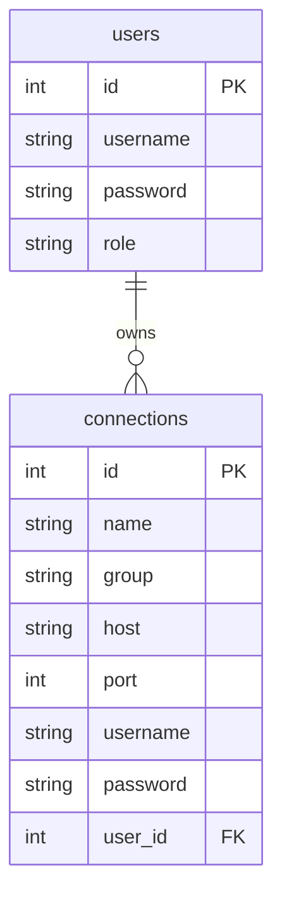

# xGate 功能与架构说明

xGate 是一款现代化、轻量级的堡垒机系统，专为安全、便捷地管理多台服务器而设计。系统支持 Web SSH 终端、文件管理、用户与权限管理、连接分组等核心功能，适合中小企业和个人运维场景。

---

## 1. 功能总览

- **Web SSH 终端**：通过浏览器安全访问服务器终端。
- **文件管理器**：支持上传、下载、浏览、删除服务器文件。
- **用户管理**：多用户体系，支持管理员与普通用户，权限隔离。
- **连接管理**：支持 SSH 连接的增删改查、分组管理。
- **多租户隔离**：普通用户仅能访问自己的连接，管理员可管理所有资源。
- **分组展示**：连接可分组，前端以折叠面板展示。
- **配置灵活**：支持 SQLite/MySQL，环境变量优先，适配容器化部署。
- **高性能缓存**：后端连接信息内存缓存，按用户隔离，自动失效。

---

## 2. 数据库结构与 ER 图

### 2.1 表结构

#### users
| 字段      | 类型         | 约束         | 说明         |
| --------- | ------------ | ------------ | ------------ |
| id        | INTEGER      | PRIMARY KEY  | 用户ID       |
| username  | VARCHAR(64)  | UNIQUE, NOT NULL | 用户名   |
| password  | VARCHAR(128) | NOT NULL     | 密码Hash     |
| role      | VARCHAR(16)  | NOT NULL     | 角色：admin/user |

#### connections
| 字段      | 类型         | 约束         | 说明         |
| --------- | ------------ | ------------ | ------------ |
| id        | INTEGER      | PRIMARY KEY  | 连接ID       |
| name      | VARCHAR(64)  | NOT NULL     | 连接名称     |
| group     | VARCHAR(64)  |              | 分组         |
| host      | VARCHAR(128) | NOT NULL     | 主机地址     |
| port      | INTEGER      | NOT NULL     | 端口         |
| username  | VARCHAR(64)  | NOT NULL     | 登录用户名   |
| password  | VARCHAR(128) |              | 登录密码     |
| user_id   | INTEGER      | FOREIGN KEY  | 所属用户ID   |

### 2.2 ER 图（Mermaid）

---

## 3. 后端接口文档

### 3.1 用户与认证
- `POST   /api/register`      用户注册（第一个用户为admin，其余为user）
- `POST   /api/login`         用户登录，返回JWT
- `POST   /api/changepwd`     修改密码（需登录）
- `GET    /api/userinfo`      获取当前用户信息

### 3.2 用户管理（仅管理员）
- `GET    /api/users`         获取所有用户列表
- `POST   /api/users`         新增用户
- `PUT    /api/users/:id`     修改用户角色
- `DELETE /api/users/:id`     删除用户
- `POST   /api/users/:id/resetpwd` 重置用户密码

### 3.3 连接管理
- `GET    /api/connections`   获取当前用户所有连接（分组返回）
- `POST   /api/connections`   新增连接
- `PUT    /api/connections/:id` 修改连接
- `DELETE /api/connections/:id` 删除连接
- `GET    /api/groups`        获取所有分组名

### 3.4 终端与文件
- `POST   /api/terminal/connect`   建立终端连接
- `POST   /api/terminal/command`   执行命令
- `POST   /api/file/upload`        上传文件
- `GET    /api/file/download`      下载文件
- `GET    /api/file/list`          文件列表
- `DELETE /api/file/delete`        删除文件

---

## 4. 权限说明
- 普通用户：仅能管理和访问自己创建的连接。
- 管理员：可管理所有用户和所有连接。
- 所有接口均需JWT认证，部分接口需管理员权限。

---

## 5. 配置与部署建议
- 推荐使用 Docker Compose 一键部署，生产环境建议使用 MySQL。
- 本地开发默认使用 SQLite，零配置开箱即用。
- 所有配置均可通过环境变量覆盖，详见 README。
- 建议生产环境仅用环境变量，不要保留 config.yaml。

---

如需更详细的功能树、接口参数、前端UI/UX细节等，请参考项目根目录下的 [README](../readme.md) 或 [README_zh](../readme_en.md)。
