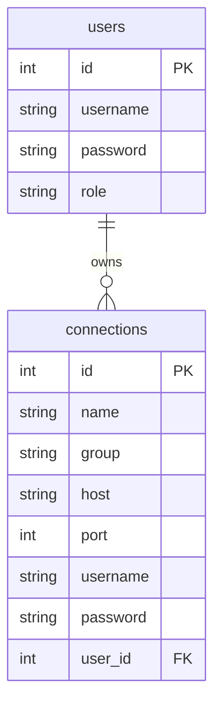

# xGate Features and Architecture Description

xGate is a modern, lightweight bastion host system designed for secure and convenient management of multiple servers. The system supports core features such as Web SSH terminal, file management, user and permission management, connection grouping, and is suitable for small and medium enterprises and personal operations scenarios.

---

## 1. Feature Overview

- **Web SSH Terminal**: Securely access server terminals through your browser.
- **File Manager**: Support for uploading, downloading, browsing, and deleting server files.
- **User Management**: Multi-user system with administrator and regular user support, permission isolation.
- **Connection Management**: Support for adding, deleting, modifying, and querying SSH connections with group management.
- **Multi-tenant Isolation**: Regular users can only access their own connections, while administrators can manage all resources.
- **Group Display**: Connections can be grouped and displayed as collapsible panels in the frontend.
- **Flexible Configuration**: Support for SQLite/MySQL, environment variables take priority, suitable for containerized deployment.
- **High-performance Caching**: Backend connection information memory cache, isolated by user, automatic expiration.

---

## 2. Database Structure and ER Diagram

### 2.1 Table Structure

#### users
| Field     | Type         | Constraints         | Description         |
| --------- | ------------ | ------------------- | ------------------- |
| id        | INTEGER      | PRIMARY KEY         | User ID             |
| username  | VARCHAR(64)  | UNIQUE, NOT NULL    | Username            |
| password  | VARCHAR(128) | NOT NULL            | Password Hash       |
| role      | VARCHAR(16)  | NOT NULL            | Role: admin/user    |

#### connections
| Field     | Type         | Constraints         | Description         |
| --------- | ------------ | ------------------- | ------------------- |
| id        | INTEGER      | PRIMARY KEY         | Connection ID       |
| name      | VARCHAR(64)  | NOT NULL            | Connection Name     |
| group     | VARCHAR(64)  |                     | Group               |
| host      | VARCHAR(128) | NOT NULL            | Host Address        |
| port      | INTEGER      | NOT NULL            | Port                |
| username  | VARCHAR(64)  | NOT NULL            | Login Username      |
| password  | VARCHAR(128) |                     | Login Password      |
| user_id   | INTEGER      | FOREIGN KEY         | Owner User ID       |

### 2.2 ER Diagram (Mermaid)

---

## 3. Backend API Documentation

### 3.1 User and Authentication
- `POST   /api/register`      User registration (first user becomes admin, others become users)
- `POST   /api/login`         User login, returns JWT
- `POST   /api/changepwd`     Change password (requires login)
- `GET    /api/userinfo`      Get current user information

### 3.2 User Management (Admin Only)
- `GET    /api/users`         Get all user list
- `POST   /api/users`         Add new user
- `PUT    /api/users/:id`     Modify user role
- `DELETE /api/users/:id`     Delete user
- `POST   /api/users/:id/resetpwd`  Reset user password

### 3.3 Connection Management
- `GET    /api/connections`   Get all connections for current user (grouped return)
- `POST   /api/connections`   Add new connection
- `PUT    /api/connections/:id`  Modify connection
- `DELETE /api/connections/:id`  Delete connection
- `GET    /api/groups`        Get all group names

### 3.4 Terminal and File
- `POST   /api/terminal/connect`    Establish terminal connection
- `POST   /api/terminal/command`    Execute command
- `POST   /api/file/upload`         Upload file
- `GET    /api/file/download`       Download file
- `GET    /api/file/list`           File list
- `DELETE /api/file/delete`         Delete file

---

## 4. Permission Description
- Regular users: Can only manage and access connections they created.
- Administrators: Can manage all users and all connections.
- All APIs require JWT authentication, some APIs require administrator permissions.

---

## 5. Configuration and Deployment Recommendations
- Recommended to use Docker Compose for one-click deployment, production environment should use MySQL.
- Local development uses SQLite by default, zero configuration out of the box.
- All configurations can be overridden through environment variables, see README for details.
- Production environment should only use environment variables, do not keep config.yaml.

---

For more detailed feature trees, API parameters, frontend UI/UX details, etc., please refer to [README](../readme_en.md) or [README](../readme.md) in the project root directory.
