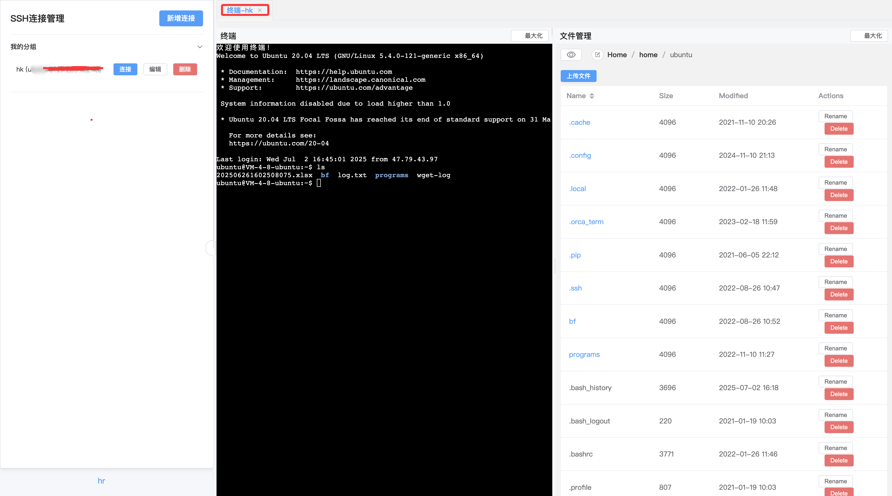

<!-- xGate Logo + English Readme Link -->
<p align="center">
  
  <a href="./readme_en.md" style="margin-left:24px; vertical-align:middle; font-size:18px;">English</a>
</p>

<p align="center">
  <a href="https://github.com/ipowerink/xgate-allinone/stargazers">
    
  </a>
</p>

# xGate - 一款现代化的堡垒机

xGate 是一个轻量、现代且易于使用的堡垒机系统，由 Golang 和 Vue.js 构建。它通过一个网页界面为您提供服务器的安全访问，集成了网页终端和文件管理功能。

关于功能、架构和数据库结构的详细说明，请参阅 [项目描述文档](./doc/description.md)。



## 功能特性

- **网页版 SSH 终端**：通过浏览器安全访问服务器终端。
- **文件管理器**：支持上传、下载、浏览、删除服务器文件。
- **用户管理**：多用户体系，支持管理员与普通用户，权限隔离。
- **连接管理**：支持 SSH 连接的增删改查、分组管理。
- **多租户隔离**：普通用户仅能访问自己的连接，管理员可管理所有资源。
- **分组展示**：连接可分组，前端以折叠面板展示。
- **配置灵活**：支持 SQLite(默认)/MySQL，环境变量优先，适配容器化部署。
- **高性能缓存**：后端连接信息内存缓存，按用户隔离，自动失效。


## 部署方式

您可以使用 Docker、Docker Compose 或在本地运行 xGate 来进行开发。

### 0. 单个docker部署(小白推荐)
``` bash
docker run -d  -p 8088:80 ipowerink/xgate-allinone
```
访问：http://localhost:8088


### 1. Docker Compose 

这是最简单的启动方式。该方式会同时启动前端、后端和一个 MySQL 数据库。

**环境要求**: 已安装 `docker` 和 `docker-compose`。

**步骤**:
1. 克隆本仓库。
2. 进入项目根目录。
3. 运行以下命令:
   ```bash
   docker-compose up -d
   ```
4. 在浏览器中访问 `http://localhost:8088`。

`docker-compose.yml` 文件已预先配置为使用 MySQL。所有数据都将持久化在 Docker 数据卷中。

### 2. 单个 Docker 容器

您可以将整个应用（前端 + 后端）运行在一个单独的 Docker 容器中。此设置默认使用内置的 SQLite 数据库，数据会持久化在容器内部。

**环境要求**: 已安装 `docker`。

**步骤**:
1. 克隆本仓库。
2. 使用根目录的 `Dockerfile` 构建镜像:
   ```bash
   docker build -t xgate-server .
   ```
3. 运行容器:
   ```bash
   # 使用 SQLite (默认)
   docker run -d -p 8088:8080 --name xgate-instance xgate-server

   # 或者，连接到外部的 MySQL 数据库
   docker run -d -p 8088:8080 --name xgate-instance \
     -e XGATE_DATABASE_TYPE=mysql \
     -e XGATE_DATABASE_HOST=<你的MySQL主机> \
     -e XGATE_DATABASE_PORT=<你的MySQL端口> \
     -e XGATE_DATABASE_USER=<你的MySQL用户名> \
     -e XGATE_DATABASE_PASSWORD=<你的MySQL密码> \
     -e XGATE_DATABASE_NAME=<你的MySQL数据库名> \
     xgate-server
   ```
4. 在浏览器中访问 `http://localhost:8088`。

### 3. 本地开发

适用于希望贡献代码或在本地运行服务的开发者。

**环境要求**: 已安装 `Go` (1.18+), `Node.js` (16+), 和 `pnpm`。

**步骤**:
1. **启动后端服务**:
   - 进入 `backend` 目录。
   - 运行服务。默认会使用 SQLite (`xgate.db`)。
     ```bash
     cd backend
     go run main.go
     ```
   - 后端将在 `http://localhost:8080` 上运行。

2. **启动前端服务**:
   - 进入 `frontend` 目录。
   - 安装依赖并运行开发服务器。
     ```bash
     cd frontend
     pnpm install
     pnpm dev
     ```
   - 前端将在 `http://localhost:5173` 上运行。开发服务器已配置 API 请求代理到后端。

## Docker 部署

### 方式一：使用 Docker Compose（推荐）

最简单的方式是使用 Docker Compose 启动所有服务：

```bash
docker-compose up -d
```

访问 http://localhost:8088 即可。

### 方式二：单独运行 Docker 容器

如果你想单独运行各个容器，需要先使用单独的 nginx 配置文件进行构建：

1. 构建后端：
```bash
cd backend
docker build -t xgate-backend .
```

2. 构建前端（使用单独配置）：
```bash
cd frontend
# 复制单独运行的配置
cp nginx-standalone.conf nginx.conf
docker build -t xgate-frontend .
```

3. 运行 MySQL：
```bash
docker run -d --name xgate-db \
  -e MYSQL_DATABASE=xgate_db \
  -e MYSQL_USER=xgate_user \
  -e MYSQL_PASSWORD=xgate_password \
  -e MYSQL_ROOT_PASSWORD=root_password \
  -p 3306:3306 \
  mysql:8.0
```

4. 运行后端：
```bash
docker run -d --name xgate-backend \
  -e XGATE_DATABASE_TYPE=mysql \
  -e XGATE_DATABASE_HOST=host.docker.internal \
  -e XGATE_DATABASE_PORT=3306 \
  -e XGATE_DATABASE_USER=xgate_user \
  -e XGATE_DATABASE_PASSWORD=xgate_password \
  -e XGATE_DATABASE_NAME=xgate_db \
  -e XGATE_SERVER_PORT=8080 \
  -e XGATE_JWT_SECRET=a_very_secret_key \
  -p 8080:8080 \
  xgate-backend
```

5. 运行前端：
```bash
docker run -d --name xgate-frontend \
  -p 8088:80 \
  xgate-frontend
```

访问 http://localhost:8088 即可。

注意：在 Linux 系统中，需要将 `host.docker.internal` 替换为宿主机的实际 IP 地址。

### 方式三：使用组合式镜像（前后端一体）

项目还提供了将前后端打包在一起的组合式镜像，这种方式只需要一个容器即可运行，适合简单部署和测试：

1. 构建组合式镜像：
```bash
docker build -t xgate-allinone .
```

2. 运行 MySQL：
```bash
docker run -d --name xgate-db \
  -e MYSQL_DATABASE=xgate_db \
  -e MYSQL_USER=xgate_user \
  -e MYSQL_PASSWORD=xgate_password \
  -e MYSQL_ROOT_PASSWORD=root_password \
  -p 3306:3306 \
  mysql:8.0
```

3. 运行组合式容器：
```bash
docker run -d --name xgate-allinone \
  -e XGATE_DATABASE_HOST=host.docker.internal \
  -p 80:80 \
  xgate-allinone
```

访问 http://localhost 即可。

注意：组合式镜像默认已经配置好了前端访问后端的代理，并且后端 API 地址为本地地址（127.0.0.1），但连接数据库时仍需要使用 host.docker.internal 或宿主机 IP。

## 环境变量

后端服务的配置可以通过环境变量进行管理。

| 变量名                   | 描述                                                                | 默认值                             |
| ------------------------ | ------------------------------------------------------------------- | ---------------------------------- |
| `XGATE_SERVER_PORT`       | 后端服务监听的端口。                                                | `8080`                             |
| `XGATE_JWT_SECRET`        | **(生产环境必需)** 用于签发 JWT 令牌的密钥。请务必修改为一个长且随机的字符串。 | `a_very_secret_key_for_local_dev`  |
| `XGATE_DATABASE_TYPE`     | 使用的数据库类型。设置为 `mysql` 以启用 MySQL。                     | `sqlite`                           |
| `XGATE_DATABASE_HOST`     | 数据库服务器的主机名或 IP 地址。                                    | `localhost`                        |
| `XGATE_DATABASE_PORT`     | 数据库服务器的端口。                                                | `3306`                             |
| `XGATE_DATABASE_USER`     | 用于连接数据库的用户名。                                            | `root`                             |
| `XGATE_DATABASE_PASSWORD` | 用于连接数据库的密码。                                              | (空字符串)                         |
| `XGATE_DATABASE_NAME`     | 要连接的数据库的名称。                                              | `xgate`                             |
| `XGATE_DATABASE_PATH`     | (仅用于 SQLite) SQLite 数据库文件的路径。                           | `xgate.db`                          |

## 贡献代码

欢迎参与贡献！您可以通过提交 Pull Request 或开启一个 Issue 来参与。 