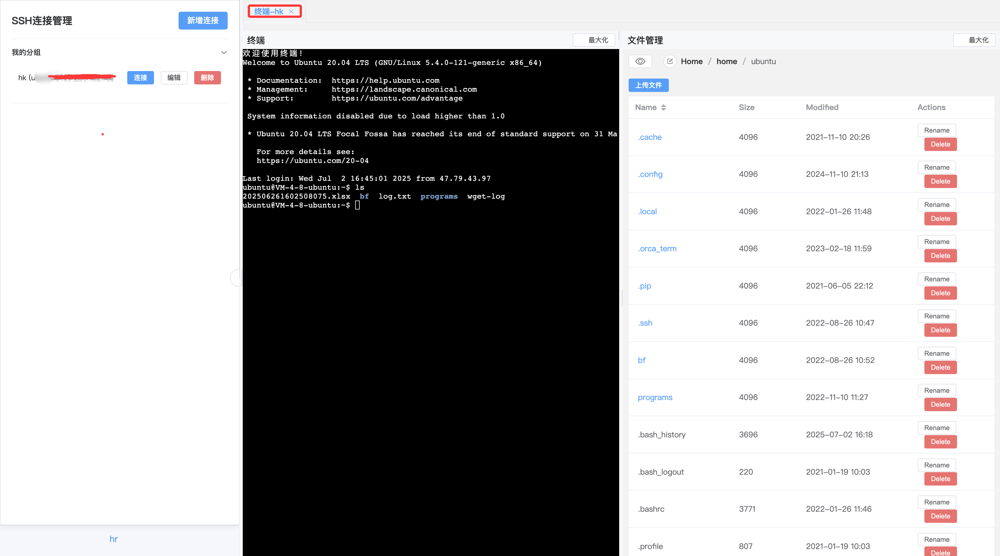

<!-- xGate Logo -->
<p align="center">
  
</p>

<p align="center">
  <a href="https://github.com/ipowerink/xgate-allinone/stargazers">
    
  </a>
</p>

# xGate - A Modern Bastion Host

xGate is a lightweight, modern, and easy-to-use bastion host system built with Golang and Vue.js. It provides secure server access through a web interface, integrating web terminal and file management capabilities.

For detailed information about features, architecture, and database structure, please refer to the [Project Description Document](./doc/description_en.md).


## Features

- **Web SSH Terminal**: Securely access server terminals through your browser.
- **File Manager**: Support for uploading, downloading, browsing, and deleting server files.
- **User Management**: Multi-user system with administrator and regular user support, permission isolation.
- **Connection Management**: Support for adding, deleting, modifying, and querying SSH connections with group management.
- **Multi-tenant Isolation**: Regular users can only access their own connections, while administrators can manage all resources.
- **Group Display**: Connections can be grouped and displayed as collapsible panels in the frontend.
- **Flexible Configuration**: Support for SQLite (default) / MySQL, environment variables take priority, suitable for containerized deployment.
- **High-performance Caching**: Backend connection information memory cache, isolated by user, automatic expiration.

## Deployment Methods

You can deploy xGate using Docker, Docker Compose, or run it locally for development.

### Method 1: Using Docker Compose (Recommended)

This is the simplest way to start all services together:

```bash
docker-compose up -d
```

Access http://localhost:8088 in your browser.

### Method 2: Running Separate Docker Containers

If you want to run separate containers, you'll need to use a custom nginx configuration:

1. Build the backend:
```bash
cd backend
docker build -t xgate-backend .
```

2. Build the frontend (using standalone config):
```bash
cd frontend
# Copy the standalone configuration
cp nginx-standalone.conf nginx.conf
docker build -t xgate-frontend .
```

3. Run MySQL:
```bash
docker run -d --name xgate-db \
  -e MYSQL_DATABASE=xgate_db \
  -e MYSQL_USER=xgate_user \
  -e MYSQL_PASSWORD=xgate_password \
  -e MYSQL_ROOT_PASSWORD=root_password \
  -p 3306:3306 \
  mysql:8.0
```

4. Run the backend:
```bash
docker run -d --name xgate-backend \
  -e XGATE_DATABASE_TYPE=mysql \
  -e XGATE_DATABASE_PORT=3306 \
  -e XGATE_DATABASE_USER=xgate_user \
  -e XGATE_DATABASE_PASSWORD=xgate_password \
  -e XGATE_DATABASE_NAME=xgate_db \
  -e XGATE_SERVER_PORT=8080 \
  -e XGATE_JWT_SECRET=a_very_secret_key \
  -p 8080:8080 \
  xgate-backend
```

5. Run the frontend:
```bash
docker run -d --name xgate-frontend \
  -p 8088:80 \
  xgate-frontend
```

Access http://localhost:8088 in your browser.

### Method 3: All-in-One Image (Frontend & Backend)

The project also provides an all-in-one image that packages frontend and backend together, requiring only one container - ideal for simple deployment and testing:

1. Build the all-in-one image:
```bash
docker build -t xgate-allinone .
```

2. Run the all-in-one container:
```bash
docker run -d --name xgate-allinone \
  -p 80:80 \
  xgate-allinone
```

Access http://localhost in your browser.

#### All-in-One Image Environment Variables

The all-in-one image uses SQLite database by default. Available environment variables:

- `XGATE_DATABASE_TYPE`: Database type, defaults to `sqlite`. Set to `mysql` if you need MySQL.
- `XGATE_SERVER_PORT`: Backend service port, defaults to `8080`.
- `XGATE_JWT_SECRET`: JWT key, defaults to a preset value.

If switching to MySQL mode, you'll need these additional variables:
```bash
docker run -d --name xgate-allinone \
  -e XGATE_DATABASE_TYPE=mysql \
  -e XGATE_DATABASE_HOST=host.docker.internal \
  -e XGATE_DATABASE_PORT=3306 \
  -e XGATE_DATABASE_USER=xgate_user \
  -e XGATE_DATABASE_PASSWORD=xgate_password \
  -e XGATE_DATABASE_NAME=xgate_db \
  -p 80:80 \
  xgate-allinone
```

**Note:** When using SQLite mode (default), MySQL-related environment variables like `XGATE_DATABASE_HOST` will be ignored.

### Local Development

Suitable for developers who want to contribute code or run the service locally.

**Requirements**: `Go` (1.18+), `Node.js` (16+), and `pnpm` installed.

**Steps**:
1. **Start the Backend Service**:
   - Navigate to the `backend` directory.
   - Run the service. It will use SQLite (`xgate.db`) by default.
     ```bash
     cd backend
     go run main.go
     ```
   - The backend will run on `http://localhost:8080`.

2. **Start the Frontend Service**:
   - Navigate to the `frontend` directory.
   - Install dependencies and run the development server.
     ```bash
     cd frontend
     pnpm install
     pnpm dev
     ```
   - The frontend will run on `http://localhost:5173`. The development server is configured to proxy API requests to the backend.

## Environment Variables

Backend service configuration can be managed through environment variables.

| Variable Name              | Description                                                           | Default Value                        |
| -------------------------- | ---------------------------------------------------------------------- | ------------------------------------ |
| `XGATE_SERVER_PORT`        | Port for the backend service to listen on.                           | `8080`                               |
| `XGATE_JWT_SECRET`         | **(Required for production)** Secret key for signing JWT tokens. Please change to a long and random string. | `a_very_secret_key_for_local_dev`    |
| `XGATE_DATABASE_TYPE`      | Database type to use. Set to `mysql` to enable MySQL.                | `sqlite`                             |
| `XGATE_DATABASE_HOST`      | Hostname or IP address of the database server (MySQL only).          | `localhost`                          |
| `XGATE_DATABASE_PORT`      | Port of the database server (MySQL only).                             | `3306`                               |
| `XGATE_DATABASE_USER`      | Username for database connection (MySQL only).                        | `root`                               |
| `XGATE_DATABASE_PASSWORD`  | Password for database connection (MySQL only).                        | (empty string)                       |
| `XGATE_DATABASE_NAME`      | Name of the database to connect to (MySQL only).                      | `xgate`                              |
| `XGATE_DATABASE_PATH`      | (SQLite only) Path to the SQLite database file.                      | `xgate.db`                           |

## Contributing

Welcome to contribute! You can participate by submitting Pull Requests or opening Issues.
